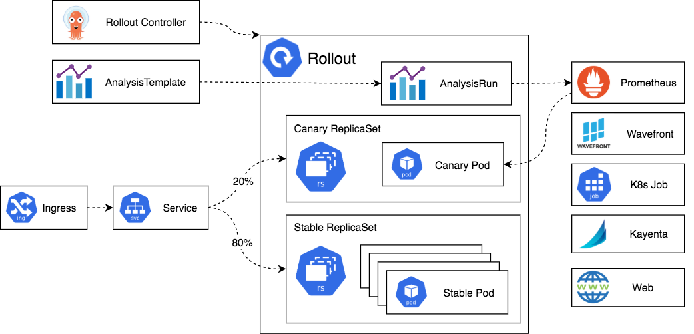
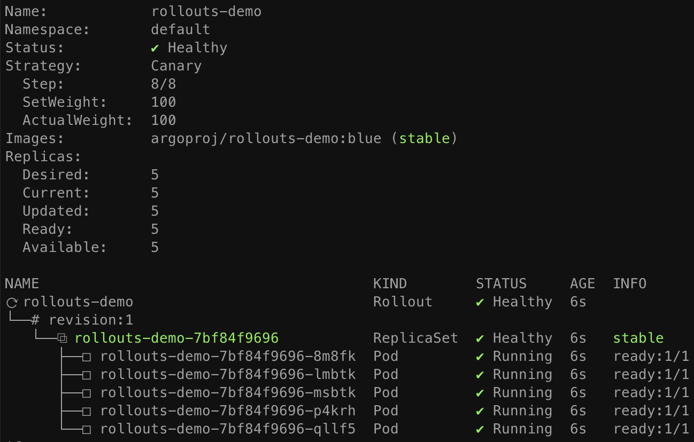
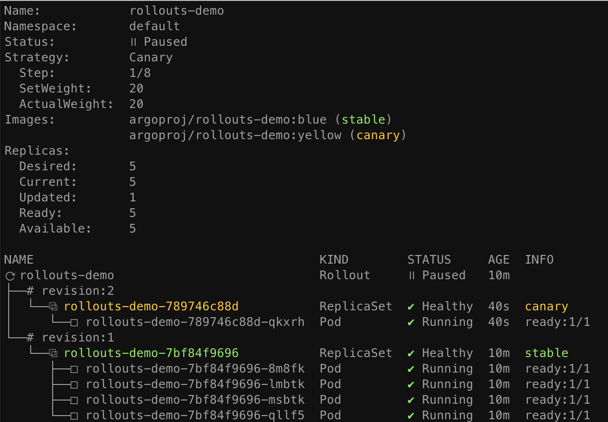
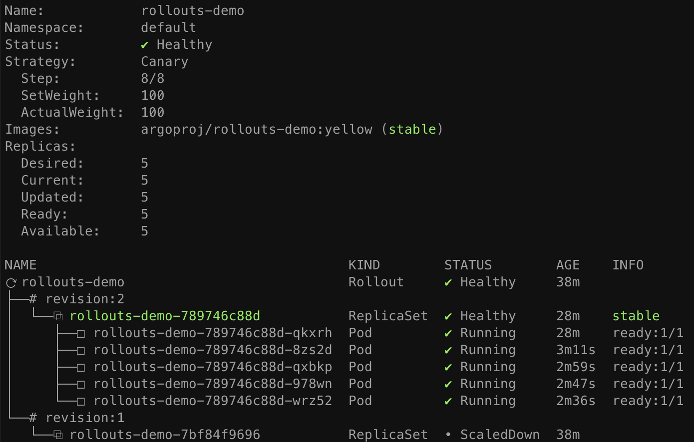
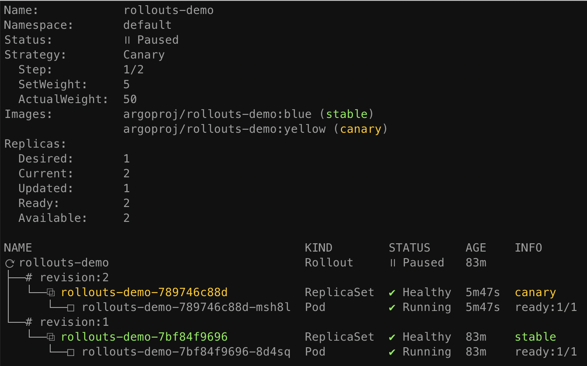
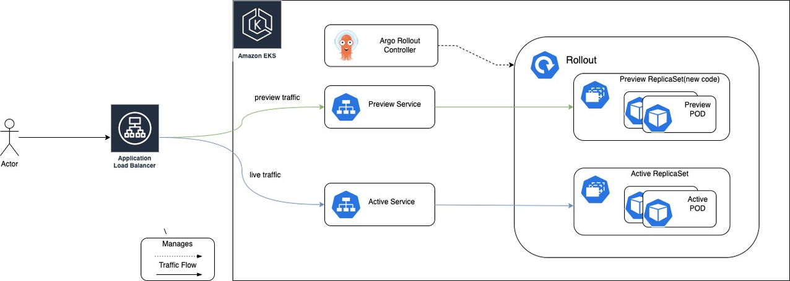

# Argo Workflows (36%)
## Understand Argo Workflow Fundamentals
## Generating and Consuming Artifacts
## Understand Argo Workflow Templates
## Understand the Argo Workflow Spec
## Work with DAG (Directed-Acyclic Graphs)
## Run Data Processing Jobs with Argo Workflows

# ARGO CD (34%)
## Understand Argo CD Fundamentals
## Synchronize Applications Using Argo CD
## Use Argo CD Application
## Configure Argo CD with Helm and Kustomize
## Identify Common Reconciliation Patterns

# Argo Rollouts (18%) 02/03-05
## Understand Argo Rollouts Fundamentals


### Why Argo Rollouts?
The native Kubernetes `Deployment` Object supports the `RollingUpdate` strategy which provides a basic set of safety guarantees (readiness probes) during an update. 
A `RollingUpdate` slowly replaces the old version with the new version. As the new version comes up, the old version is scaled down in order to maintain the overall count of the application. 

However the rolling update strategy faces many limitations:

* Few controls over the speed of the rollout
* Inability to control traffic flow to the new version 
    * Old and new Pods Co-exist, both serve traffic at the same time because of service label selection
* Readiness probes are unsuitable for deeper, stress, or one-time checks
* No ability to query external metrics to verify an update
* Can halt the progression, but unable to automatically abort and rollback the update

To solve all this limitations the concept of Progressive delivery is introduced:
* The process of releasing updates of a product in a controlled gradual manner
* Reducing risk of failure by coupling it with rollback and promotion automation based on metric analysis (as results of experimentation)


### `Rollout` CRD

A Rollout acts as a drop-in replacement for a Deployment resource. It provides additional blueGreen and canary update strategies. 

These strategies can create AnalysisRuns and Experiments during the update, which will progress the update, or abort it.


### How it works
The `Rollout` object is a replacement for a Deployment or Applications objects
```
apiVersion: argoproj.io/v1alpha1
kind: Rollout
```

New `spec.template` part of the manifest controlls the deployment of the `ReplicaSet` that used to be managed by the Deployment object.
```yaml
spec:
  replicas: 5
  strategy:
    canary:
      steps:
      - setWeight: 20
      - pause: {}
      - setWeight: 40
      - pause: {duration: 10}
      - setWeight: 60
      - pause: {duration: 10}
      - setWeight: 80
      - pause: {duration: 10}
```
Changes to the spec signal the Rollouts controller that a new ReplicaSet will be introduced.
The `spec.strategy' field will be used to sync the old ReplicaSet to the new one.
Once the new ReplicaSet finished scalling up (and optionally passes Analysis) it will be marked as `stable`
If a new change occurs to `spec.template` while the transition is happening, it will be stopped (scalled down) and the new strategy will be used instead.


## Use Common Progressive Rollout Strategies

### Canary update strategy
1. (Deployment) Create a subset (% of total) of pods with new versions of the application
1. (Traffic) Exposes a subset of users to the new version of the application while serving the rest of the traffic to the old version.
3. (Traffic) Ingress controllers and service meshes such as NGINX and Istio, enable more sophisticated traffic shaping patterns for canarying.
2. (cutoff) Once the new version is verified to be correct, the new version can gradually replace the old version. 



#### Deployment with Canary strategy

```yaml
apiVersion: argoproj.io/v1alpha1
kind: Rollout
metadata:
  name: rollouts-demo
spec:
  replicas: 5
  strategy:
    canary:
      steps:
      - setWeight: 20
      - pause: {}
      - setWeight: 40
      - pause: {duration: 10}
      - setWeight: 60
      - pause: {duration: 10}
      - setWeight: 80
      - pause: {duration: 10}
  revisionHistoryLimit: 2
  selector:
    matchLabels:
      app: rollouts-demo
  template:
    metadata:
      labels:
        app: rollouts-demo
    spec:
      containers:
      - name: rollouts-demo
        image: argoproj/rollouts-demo:blue
        ports:
        - name: http
          containerPort: 8080
          protocol: TCP
        resources:
          requests:
            memory: 32Mi
            cpu: 5m
```

Initial rollout will scale up stable replicas to 100%, skipping canary and analysis.
Using the argo plugin will visualize the Rollout in ReplicaSets, Pods and Status
```sh
kubectl argo rollouts get rollout rollouts-demo --watch
```



Updating the Rollout by changing `spec.template` with a new image version.

```sh
kubectl argo rollouts set image rollouts-demo \
  rollouts-demo=argoproj/rollouts-demo:yellow
```

During the update the controller will progress trough the steps defined in the manifest.

In this example after 20% traffic weight goes to the canary it pauses until an user action is taken and the rest are 10 seconds pauses between steps





#### Automated rollbacks and promotions

Promoting or unpausing the Rollout, use `--full` to skip remaining steps

```sh
kubectl argo rollouts promote (--full) rollouts-demo
```

Once all steps complete successfully, the new ReplicaSet is marked as the "stable" ReplicaSet or if failed fallback to the "stable" version.



Abort the update to fallback to the "stable" version and the status will be `Degraded` because the update was not sucessfull.

```sh
kubectl argo rollouts abort rollouts-demo
```

To go back to `Healthy` status the rollout spec must match the previous state before the upgrade.

```sh
kubectl argo rollouts set image rollouts-demo \
  rollouts-demo=argoproj/rollouts-demo:yellow
```

#### Ingress controller integration for Canary
NGINX
```yaml
apiVersion: argoproj.io/v1alpha1
kind: Rollout
metadata:
  name: rollouts-demo
spec:
  strategy:
    canary:
      # Reference to a Service which the controller will update to point to the canary ReplicaSet
      canaryService: rollouts-demo-canary
      # Reference to a Service which the controller will update to point to the stable ReplicaSet
      stableService: rollouts-demo-stable
      trafficRouting:
        nginx:
          # Reference to an Ingress which has a rule pointing to the stable service (e.g. rollouts-demo-stable)
          # This ingress will be cloned with a new name, in order to achieve NGINX traffic splitting.
          stableIngress: rollouts-demo-stable
...
```
The Ingress referenced in `canary.trafficRouting.nginx.stableIngress` is required to have a host rule which has a backend targeting the Service referenced under `canary.stableService`.



The NGINX ingress controller examines the original Ingress, the canary Ingress, and the canary-weight annotation to determine what percentage of traffic to split between the two Ingresses.
```yaml
apiVersion: extensions/v1beta1
kind: Ingress
metadata:
  name: rollouts-demo-rollouts-demo-stable-canary
  annotations:
    kubernetes.io/ingress.class: nginx
    nginx.ingress.kubernetes.io/canary: "true"
    nginx.ingress.kubernetes.io/canary-weight: "5"
spec:
  rules:
  - host: rollouts-demo.local
    http:
      paths:
      - backend:
          serviceName: rollouts-demo-canary
          servicePort: 80
```

### Blue-Green update strategy
1. (deployment) Has both the new and old version of the application deployed at the same time. 
2. (traffic) Only the old version of the application will receive production traffic. 
3. (cutoff) This allows to run tests against the new version before switching the live traffic to the new version.

#### Deployment with Blue-Green strategy

```yaml
apiVersion: argoproj.io/v1alpha1
kind: Rollout
metadata:
  name: rollout-bluegreen
spec:
  strategy:
    blueGreen: 
      # activeService specifies the service to update with the new template hash at time of promotion.
      # This field is mandatory for the blueGreen update strategy.
      activeService: rollout-bluegreen-active
      # previewService specifies the service to update with the new template hash before promotion.
      # This allows the preview stack to be reachable without serving production traffic.
      # This field is optional.
      previewService: rollout-bluegreen-preview
      # autoPromotionEnabled disables automated promotion of the new stack by pausing the rollout
      # immediately before the promotion. If omitted, the default behavior is to promote the new
      # stack as soon as the ReplicaSet are completely ready/available.
      # Rollouts can be resumed using: `kubectl argo rollouts promote ROLLOUT`
      autoPromotionEnabled: false
  replicas: 2
  revisionHistoryLimit: 2
  selector:
    matchLabels:
      app: rollout-bluegreen
  template:
    metadata:
      labels:
        app: rollout-bluegreen
    spec:
      containers:
      - name: rollouts-demo
        image: argoproj/rollouts-demo:blue
        imagePullPolicy: Always
        ports:
        - containerPort: 8080
```

* Beginning at a fully promoted, steady-state, an `Active` (Live/Active) ReplicaSet is pointed to by both the activeService and previewService.
* A user initiates an update by modifying the pod template (spec.template.spec).
* The revision `Preview` ReplicaSet is created with size 0.
* The `previewService` is modified to point to the `Preview` ReplicaSet. The activeService remains pointing to `Active`.
* Once the `Preview` ReplicaSet Pods are fully available, `prePromotionAnalysis` begins.
    * Upon success of `prePromotionAnalysis`, the blue/green pauses if autoPromotionEnabled is false, or autoPromotionSeconds is non-zero.
* The rollout is resumed either manually by a user, or automatically by surpassing `autoPromotionSeconds`.
* The rollout "promotes" the `Preview` ReplicaSet by updating the `activeService` to point to it. At this point, there are no services pointing to `Active`
* `postPromotionAnalysis` analysis begins
    * Once postPromotionAnalysis completes successfully, the update is successful and `Preview` ReplicaSet is marked as stable and considered the new `Active` RS. 
    * The rollout is considered fully-promoted.
* After waiting `scaleDownDelaySeconds` (default 30 seconds), the old `Active` ReplicaSet is scaled down



#### Metric provider integration

```yaml
apiVersion: argoproj.io/v1alpha1
kind: AnalysisTemplate
metadata:
  name: success-rate
spec:
  args:
  - name: service-name
  metrics:
  - name: success-rate
    interval: 5m
    provider:
      prometheus:
        address: http://prometheus.example.com:9090
```
## Describe Analysis Template and AnalysisRun
### AnalysisTemplate and ClusterAnalysisTemplate CRD

* An `AnalysisTemplate` is a template spec which defines how to perform a canary analysis, such as the metrics which it should perform, its frequency, and the values which are considered successful or failed. 
* AnalysisTemplates may be parameterized with inputs values, limited to its namespace
* A `ClusterAnalysisTemplate` is like an AnalysisTemplate, but it is not limited to its namespace. It can be used by any Rollout throughout the cluster.

### AnalysisRun CRD
* An AnalysisRun is an *instantiation* of an AnalysisTemplate. 
* AnalysisRuns are like Jobs in that they eventually complete. 
* Completed runs are considered Successful, Failed, or Inconclusive, and the result of the run affect if the Rollout's update will continue, abort, or pause, respectively.

### Blue-green strategy Analysis
* Once Preview ReplicaSet Pods are fully available, `prePromotionAnalysis` begins.
* Upon *success* of `prePromotionAnalysis`, the blue/green pauses if `autoPromotionEnabled` is false, or `autoPromotionSeconds` is non-zero.
* The rollout is resumed either manually by a user, or automatically by surpassing `autoPromotionSeconds`.
...
* The rollout "promotes" the Preview ReplicaSet by updating the activeService to point to it. At this point, there are no services pointing to revision 1
`postPromotionAnalysis` analysis begins
* Once `postPromotionAnalysis` completes *successfully*, the update is successful and the revision 2 ReplicaSet is marked as *stable*. The rollout is considered fully-promoted.


### Canary strategy Analysis
* In the background `strategy.canary.analysis` or as a step `strategy.canary.steps[].analysis`, an `AnalysisRun` is started based on the `AnalysisTemplate` named `success-rate`. 
* The success-rate template queries a prometheus server, measuring the HTTP success rates at 5 minute intervals/samples. It has no end time, and continues until stopped or failed. If the metric is measured to be less than 95%, and there are three such measurements, the analysis is considered Failed. 
* The failed analysis causes the Rollout to abort, setting the canary weight back to zero, and the Rollout would be considered in a *Degraded*

```yaml
apiVersion: argoproj.io/v1alpha1
kind: Rollout
metadata:
  name: guestbook
spec:
...
  strategy:
    canary:
      analysis:
        templates:
        - templateName: *success-rate*
        startingStep: 2 # delay starting analysis run until setWeight: 40%
        args:
        - name: service-name
          value: guestbook-svc.default.svc.cluster.local
      steps:
      - setWeight: 20
      - pause: {duration: 10m}
      - analysis:
          templates:
          - templateName: success-rate
      - setWeight: 40
      - pause: {duration: 10m}
      - setWeight: 60
      - pause: {duration: 10m}
      - setWeight: 80
      - pause: {duration: 10m}
```
AnalysisTemplate

```yaml
apiVersion: argoproj.io/v1alpha1
kind: AnalysisTemplate
metadata:
  name: success-rate
spec:
  args:
  - name: service-name
  metrics:
  - name: *success-rate*
    interval: 5m
    # NOTE: prometheus queries return results in the form of a vector.
    # So it is common to access the index 0 of the returned array to obtain the value
    successCondition: result[0] >= 0.95
    failureLimit: 3
    provider:
      prometheus:
        address: http://prometheus.example.com:9090
        query: |
          sum(irate(
            istio_requests_total{reporter="source",destination_service=~"{{args.service-name}}",response_code!~"5.*"}[5m]
          )) /
          sum(irate(
            istio_requests_total{reporter="source",destination_service=~"{{args.service-name}}"}[5m]
          ))
```
### BlueGreen Pre Promotion Analysis

A Rollout using the BlueGreen strategy can launch an `prePromotionAnalysis` before it switches traffic to the new version using pre-promotion. 

```yaml
apiVersion: argoproj.io/v1alpha1
kind: Rollout
metadata:
  name: guestbook
spec:
...
  strategy:
    blueGreen:
      activeService: active-svc
      previewService: preview-svc
      prePromotionAnalysis:
        templates:
        - templateName: smoke-tests
        args:
        - name: service-name
          value: preview-svc.default.svc.cluster.local
```

### AnalysisTemplate
https://argo-rollouts.readthedocs.io/en/stable/features/analysis/

* Capability to connect a `Rollout` to your metrics provider
* Define specific *thresholds* for certain metrics that will *decide if an update is successful or not.
  * For each analysis you can define one or more metric queries along with their expected results. 
* A Rollout will progress on its own if metric queries are good
* Rollback automatically if metrics show failure
* Pause the rollout if metrics cannot provide a success/failure answer.
* `AnalysisTemplate` contains instructions on what metrics to query at the Rollout level or globally with `ClusterAnalysisTemplate`
* The actual result that is attached to a `Rollout` is the `AnalysisRun` custom resource. 
* Pausing or promoting a rollout
    * Analysis is optional
    * Can be done manually or mixing both 
    * Via a K8s `Job` 
    * Via a [Webhook](https://argo-rollouts.readthedocs.io/en/stable/analysis/web/#web-metrics), `metrics.[].provider.web.`

### Experiments
#### Experiment CRD
* The canonical use case for an Experiment is to start a baseline and canary deployment in parallel, and compare the metrics produced by the baseline and canary pods for an equal comparison.
* Can only be used in Canary strategy
* Experiments typically run for a pre-determined duration, but can also run indefinitely until stopped. 
* Experiments may reference an `AnalysisTemplate` to run during or after the experiment. 
    * The Experiment CRD allows users to have ephemeral runs of one or more ReplicaSets.
    * Using `AnalysisRuns` to evaluate the baseline and optionally the canary ReplicaSets.
* The `AnalysisRun` is used to confirm that new ReplicaSets are running as expected.

#### Integration With Rollouts
* A rollout using the Canary strategy can create an experiment using an experiment step. 
    * The experiment step serves as a blocking step for the Rollout, and a Rollout will not continue until the Experiment succeeds. 
    * The Rollout creates an Experiment using the configuration in the experiment step of the Rollout
    * The expriment runs an AnalysisRun that has access to a new ReplicaSet `Baseline` and the `Canary` RS 
    * If the Experiment fails or errors, the Rollout will abort.
```yaml
strategy:
    canary: 
      steps:
      - experiment:
          duration: 1h
          templates:
          - name: baseline
            specRef: stable
          - name: canary
            specRef: canary
          analyses:
          - name : mann-whitney
            templateName: mann-whitney
```
# Argo Events (12%) 02/05-09
## Understand Argo Events Fundamentals
## Understand Argo Event Components and Architecture
